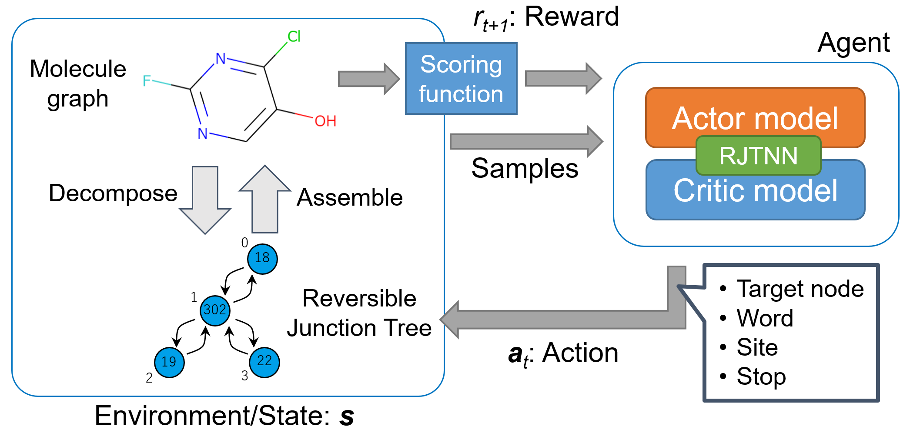

# RJT-RL: De novo molecular design using a Reversible Junction Tree and Reinforcement Learning
Implementation of "Molecular design method using a reversible tree representation of chemical compounds and deep reinforcement learning" by Ryuichiro Ishitani, Toshiki Kataoka, Kentaro Rikimaru.  
(Paper: https://doi.org/10.1021/acs.jcim.2c00366)



## Environment
This package run under the environment:
* Python: 3.8
* RDKit: 2020.09.3

The other package dependencies are described in [requirements.txt](/requirements.txt).

To install the package and dependencies:
```
pip install .
```

## Usage
### Pretraining the policy network
**Caution:** This repository already contains the pretrained policy's weight file ([file](/results/best_model.pt)) using Zinc250k dataset,
so you can skip this section if you are not trying to use other molecule libraries for the expert dataset.

To pretrain the policy network using [Zinc250k dataset](/data/zinc250k.csv):
1. Download the dataset (into the data directory)
```
mkdir data
wget https://raw.githubusercontent.com/aspuru-guzik-group/chemical_vae/main/models/zinc/250k_rndm_zinc_drugs_clean_3.csv -O data/zinc250k.csv
```

2. Preprocess the csv file containing the SMILES and create the vocabulary file and pkl files containing preprocessed mols.
```
bash examples/run_prep_dataset.sh
```
The files will be created in the directory "results".

3. Create the worker's pkl files for the pretraining from the preprocessed pkl files. This example supposes 16 worker processes used in the training.
```
bash examples/pretrain/run_create_expert_dataset.sh
```

4. Run the pretraining of the policy network using the created dataset files.
```
bash examples/pretrain/run_pretrain_policy.sh
```
You may change the size of hidden vectors (128 in the example) and num of worker processes (16 in the examples) depending on your dataset and/or environment. 

### Training and exploration of molecules
To train the policy using the specific reward functions, run the script contained in the specific subdirectories.
* [Penalized LogP](/examples/penalized_logp)
* [Similarity](/examples/similarity)

## Citation
If you find our work relevant to your research, please cite:
```
@article{ishitani2022rjtrl,
    title={Molecular design method using a reversible tree representation of chemical compounds and deep reinforcement learning},
    author={Ryuichiro Ishitani and Toshiki Kataoka and Kentaro Rikimaru},
    year={2022},
    journal={J. Chem. Inf. Model. https://doi.org/10.1021/acs.jcim.2c00366}
}
```
